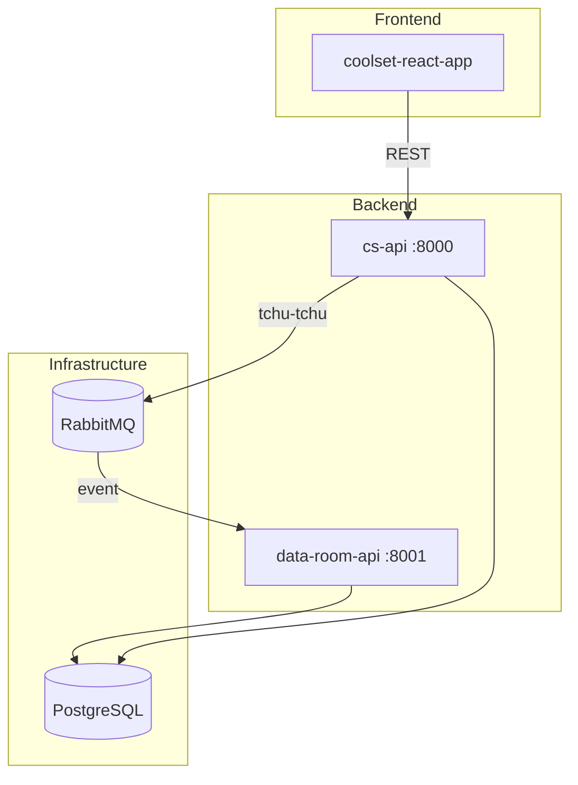
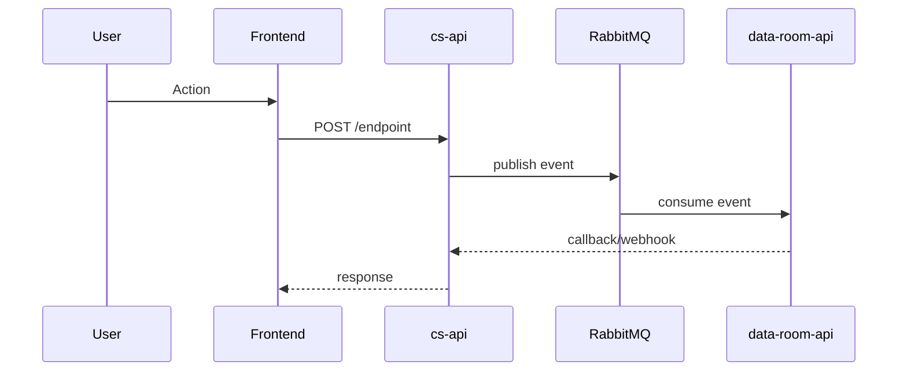

# Linear Ticket Template — Planned Feature

This is the template structure the `/plan` skill writes to Linear issue descriptions. It ensures consistency across all planned tickets and separates human-readable context from AI-readable implementation details.

## Template

```markdown
## Original Description

[Preserve the original ticket description exactly as the author wrote it. This section must always remain at the top of the ticket and must never be edited, summarized, or reworded. It serves as the original prompt/context for the work.]

## Background

[2-3 paragraphs: product context, user need, business value. Written for humans — PMs, designers, and engineers should all understand this section.]

## Architecture



[Auto-generated from code exploration. Shows services, data stores, and communication paths relevant to this ticket. Keep to 15-20 nodes max.]

## Data Flow



[Auto-generated: shows the request/event flow for the primary use case. Include error paths if they cross service boundaries.]

## Affected Repos

| Repo | Impact | Changes |
|------|--------|---------|
| cs-api | High | New endpoint, model changes |
| coolset-react-app | Medium | New page in Emissions module |
| cs-common | Low | New event type |

## Risks & Dependencies

- [ ] Requires migration coordination between cs-api and data-room-api
- [ ] New tchu-tchu event needs subscriber in cs-scranton
- [ ] Feature flag needed for gradual rollout

---
<!-- AI Context | Updated: YYYY-MM-DD | Repos: cs-api@main, coolset-react-app@main -->

## Implementation Plan

### Step 1: [repo] — [what]

**Files:**
- `path/to/file1.py` — [what changes]
- `path/to/file2.py` — [what changes]

**Pattern:** Follow `path/to/existing_similar.py` for [pattern name]

### Step 2: [repo] — [what]

**Files:**
- `path/to/file3.tsx` — [what changes]

**Pattern:** Follow `src/modules/ExistingModule/` for module structure

## Test Strategy

### cs-api
- Unit tests for new repository methods
- Integration tests for new endpoint
- Event publishing test

### coolset-react-app
- Component tests for new page
- Hook tests for data fetching
- E2E test for full flow (if applicable)

## Acceptance Criteria

- [ ] [Verifiable assertion about behavior]
- [ ] [Verifiable assertion about behavior]
- [ ] All tests passing
- [ ] No regressions in related features
```

## Usage Notes

- The separator `---` with the HTML comment marks the boundary between human and AI sections
- The `Updated` timestamp and `Repos: repo@branch` help detect staleness
- File paths should be exact (verified during exploration), not guessed
- Mermaid diagrams should be valid and renderable in Linear
- The **Original Description** section must always remain at the top, unmodified — it is the author's original context
- When re-running `/plan` on an existing ticket, replace everything below the Original Description section (don't append)
